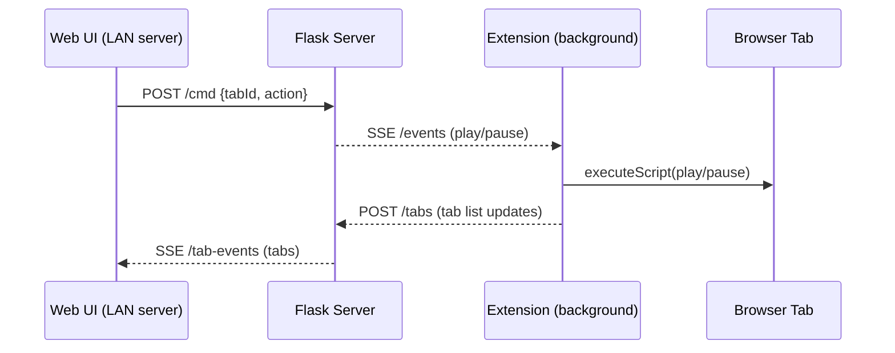

# Audio Bonanza


**Audio Bonanza** is a Chrome extension for advanced per-tab audio control (speed, reverb, bass, pitch) that works entirely on its own.

The **LAN server** is optional. It only provides a small web UI to remotely send **play/pause** to tabs on the same machine.

## Extension (primary)

- Lives in `audio-bonanza-extension/`.
- Works without the server.
- Provides the full audio controls via the extension popup.

### Load the extension

1. Open `chrome://extensions`.
2. Enable **Developer mode**.
3. Click **Load unpacked**.
4. Select the `audio-bonanza-extension` folder.

## LAN server (optional play/pause remote)

- Lives in `LAN-server/`.
- Serves a small web UI (tabs list + play/pause).
- Pushes play/pause commands to the extension over Server-Sent Events (SSE).

### Run the server

```bash
python3 LAN-server/server.py
```

Open `http://localhost:5055` and use the token shown in the UI (QR code is optional).

### Flow


