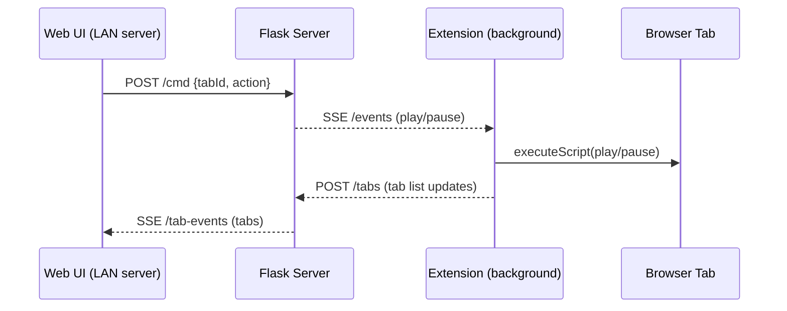

# Audio Bonanza - Extension & LAN server


**Audio Bonanza** is a **totally free** Chrome extension for **fun** realtime audio control.

The **LAN server** is optional and provides a UI to remotely send **play/pause** to tabs on the machine running it (with the extension enabled).

## Extension (primary)

- Lives in `audio-bonanza-extension`.
- Works without the server.
- Provides the full audio controls via the extension popup.

### Controls

| Control | Range | Description |
|---------|-------|-------------|
| Speed | 0.50–1.50× | Playback rate |
| Reverb | 0–150% | Wet/dry mix for convolution reverb |
| Bass Boost | 0–10 dB | Low-shelf filter at 160 Hz |
| Delay | 0–1000 ms | Echo delay time |
| Delay Echo | 0–80% | Feedback (number of echo repeats) |
| Volume | 0–200% | Master output gain |
| Preserve Pitch | on/off | Keeps pitch locked when speed changes |

Double-click any slider to reset it to its default value. Three built-in presets: **Slowed + Reverb**, **Nightcore**, **Off**.

### Load the extension

1. Open `chrome://extensions`.
2. Enable **Developer mode**.
3. Click **Load unpacked**.
4. Select the `audio-bonanza-extension` folder.

## LAN server (optional play/pause remote)

- Lives in `LAN-server/`.
- Serves a small web UI (tabs list + play/pause).
- Pushes play/pause commands to the extension over Server-Sent Events (SSE).

### Run the server

```bash
python3 LAN-server/server.py
```

Open `http://localhost:5055` and use the token shown in the UI (QR code is optional).

### Flow



## Roadmap

Planned features and ideas are tracked in [issues](../../issues).