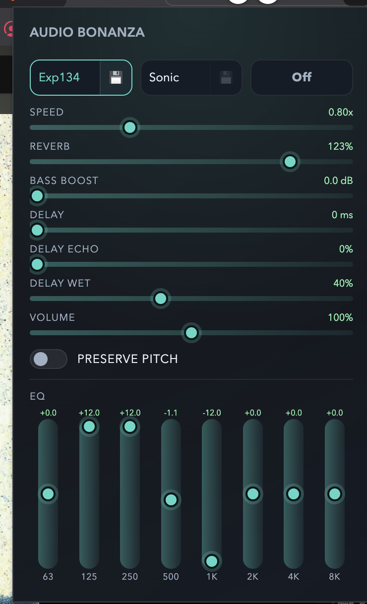
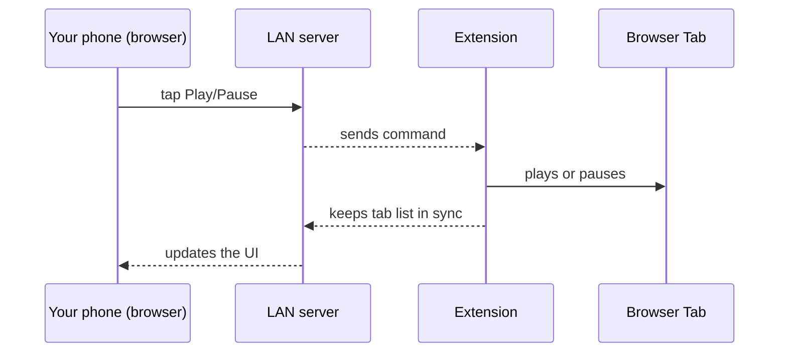

# Audio Bonanza
> Free. No account. No subscription. Just audio control.



**Audio Bonanza** is a free Chrome extension that gives you real-time control over any audio playing in your browser — speed, reverb, bass, delay, EQ, and more. Tweak it, save presets, and make everything sound exactly how you want.

Works on YouTube, Spotify Web, SoundCloud, podcasts, video calls — any tab with audio.

## 🎛️ Controls

| Control | Range | Description |
|---------|-------|-------------|
| Speed | 0.50–1.50× | Playback rate |
| Reverb | 0–150% | Wet/dry mix for convolution reverb |
| Bass Boost | 0–10 dB | Low-shelf filter at 160 Hz |
| Delay | 0–1000 ms | Echo delay time |
| Delay Echo | 0–80% | Feedback (number of echo repeats) |
| Volume | 0–200% | Master output gain |
| EQ | ±12 dB × 8 bands | Full equalizer |
| Preserve Pitch | on/off | Keeps pitch locked when speed changes |

Double-click any slider to reset it. Save your favourite settings as **Preset A** or **Preset B** — they persist across sessions.

## 📲 Control from your phone (or any device on your network)

Ever wanted to skip a track or pause the music from your couch, kitchen, or another room — without touching your computer?

The optional LAN server turns any device on your home network into a remote control. Open the URL on your phone, and you get a simple page that can play/pause any browser tab on your machine. No app to install, no Bluetooth pairing, no third-party service. Just your local network.

Great for:
- Pausing music while on a call without alt-tabbing
- Controlling a playlist from your phone while cooking
- Shared listening setups where multiple people want control

### Run it

```bash
python3 LAN-server/server.py
```

Open `http://localhost:5055` — you'll see a QR code to scan from your phone.

### How it works


```mermaid
sequenceDiagram
  participant Phone as Your phone (browser)
  participant Server as LAN server
  participant Ext as Extension
  participant Tab as Browser Tab

  Phone->>Server: tap Play/Pause
  Server-->>Ext: sends command
  Ext->>Tab: plays or pauses
  Ext-->>Server: keeps tab list in sync
  Server-->>Phone: updates the UI
```

## Install the extension

1. Open `chrome://extensions`
2. Enable **Developer mode** (top right)
3. Click **Load unpacked**
4. Select the `audio-bonanza-extension` folder

## Roadmap

Ideas and planned features are tracked in [issues](../../issues).
